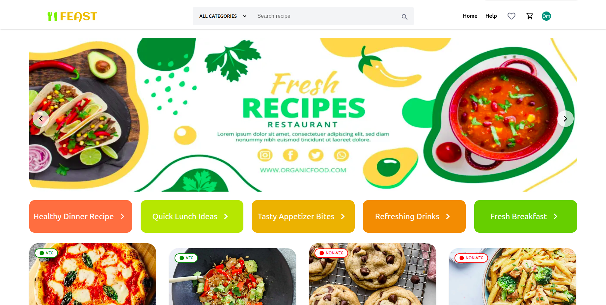
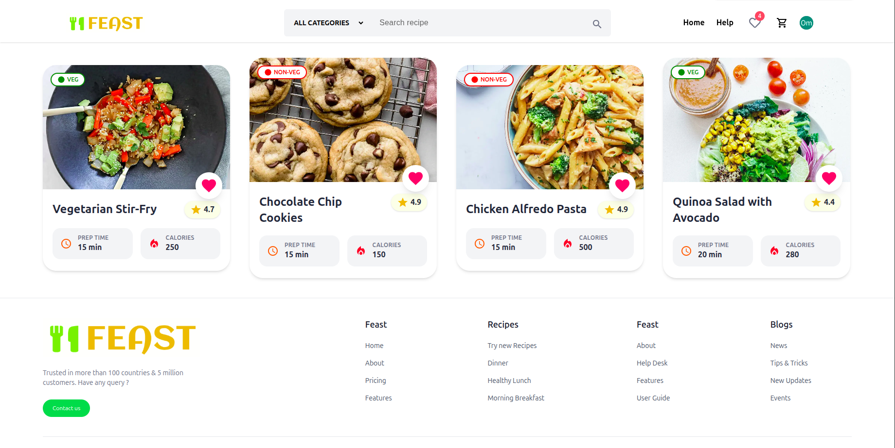
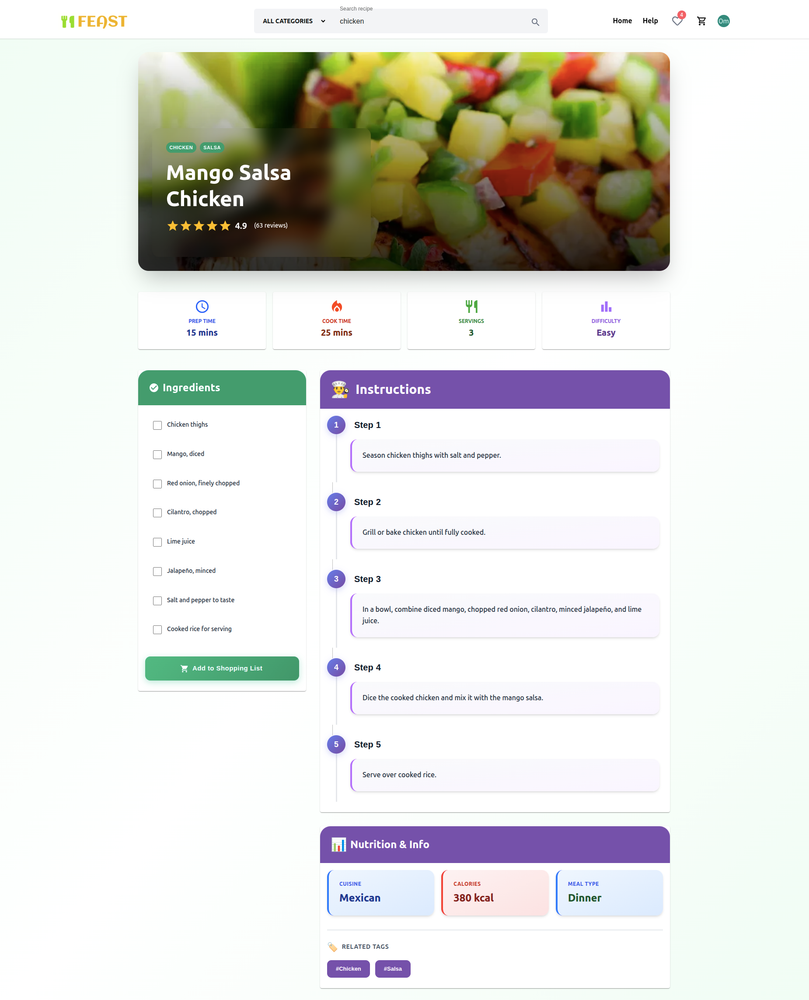
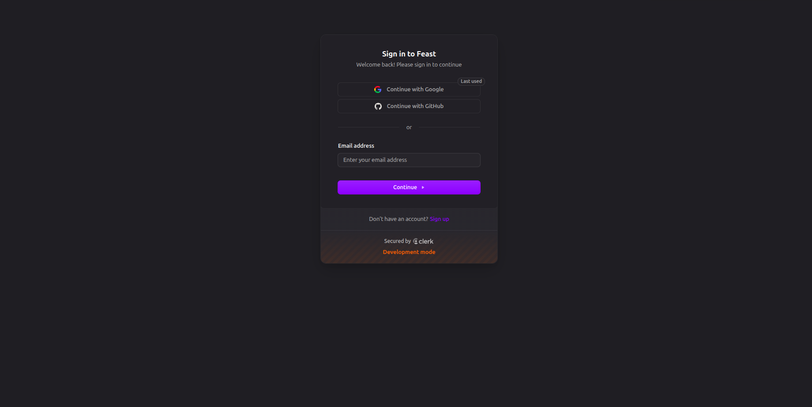

# 🍝 Feast | Recipe Viewer - [(Link)](https://feast-lovat.vercel.app/)

Feast is a Recipe Viewer application built using **Next.js**, **Tailwind CSS**, **Redux Toolkit** to Simplify the process of Recipe Searching.


## 📖 Table of Contents
- [Introduction](#-introduction)
- [Features](#-features)
- [Tech Stack](#-tech-stack)
- [Installation](#️-installation)
- [API](#-api)
- [Screenshots](#screenshots)
- [License](#-license)

## 📝 Introduction
Feast is Modern, Responsive online Recipe Viewer App where users can browse, search Recipes with Categories(Lunch, Dinner, Breakfast, Beverage etc) and manage a shopping cart.

## ✨ Features
- Recipe Browsing With categories
- Responsive UI
- Search Recipes (By title)
- Add Recipes to favorites
- Manage Shopping List
- Authentication with clerk
- Global Store(Redux Toolkit)


## 🧰 Tech Stack
- [Next.js](https://nextjs.org/docs)
- [Material UI (MUI)](https://mui.com/)
- [Tailwind CSS](https://tailwindcss.com/)
- [Redux Toolkit](https://redux-toolkit.js.org/)
- [clerk (Library for Authentication)](https://clerk.com/docs/nextjs/getting-started/quickstart)

## ⚙️ Installation

```
git clone git@github.com:patilOm1680/Feast.git
```
```
cd Feast
```

```
npm install
```

```
npm run dev
```


## 🔌 API

### Setup Environment Variables

1. Create a `.env.local` file in the root directory of the project.
2. Add the following environment variables to the `.env.local` file:

```bash
#All Recipes
NEXT_PUBLIC_RECIPIES=https://dummyjson.com/recipes?limit=100

# Recipe by id
NEXT_PUBLIC_FETCH_RECIPE_BY_ID=https://dummyjson.com/recipes

#clerk key
NEXT_PUBLIC_CLERK_PUBLISHABLE_KEY=pk_test_YmV0dGVyLWJlZGJ1Zy03Mi5jbGVyay5hY2NvdW50cy5kZXYk
```

## Screenshots








## 📄 License
No license right now.